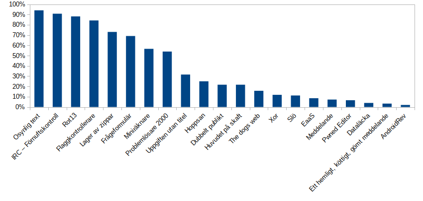
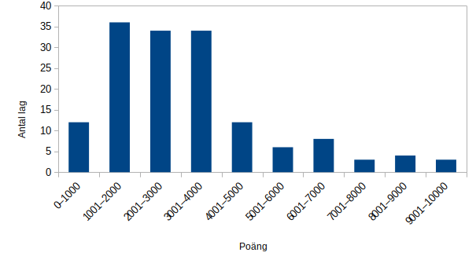

# FOI 20/20 CTF Writeups by team 0xDEADBEEF
[](https://creativecommons.org/licenses/by-nc-sa/4.0/)

Korta lösningar till några uppgifter från [FOI](https://www.foi.se):s [20/20 CTF](https://2020ctf.crate.foi.se/). Koden som hör till lösningarna är den kod vi skrev under tävlingen, så den är kanske inte den vackraste – men den funkar!

* [Om oss](#om-oss)
* [Lite statistik](#lite-statistik)
* [Lösta uppgifter](#lösta-uppgifter)

## Om oss
Laget 0xDEADBEEF bestod av fem personer som delar ett intresse för IT och cybersäkerhet. Vi sammanstrålade för första gången på dagen för CTF:en och förberedelserna var därför inte alls omfattande. Dessutom var det första gången någon i laget deltog i en CTF. Det gör att vi är extra nöjda med resultatet – 17:e plats av 152.

Lagets styrkor ligger inom webb, nätverk och krypto men med friskt mod och glada tillrop löstes många uppgifter i andra kategorier också.

### CrashOverride
Jag är doktorand i "något med cyber" med fokus på säkerhet i trådlösa system för samhällets säkerhet. Jag har en bakgrund i Försvarsmakten där jag har jobbat med fartyg med begränsad flytförmåga och saker som blinkar, lyser och låter.

Min starkaste CTF-kategori är krypto, men jag hugger gärna in på det mesta.

[Twittrar](https://twitter.com/dansarie) och lägger upp en del projekt på [Github](https://www.github.com/dansarie).

### dnov
Jag är cybersäkerhetskonsult med bakgrund i Försvarsmakten där jag mest arbetade med radarsystem och logistik. Jobbar idag på [Afry](https://afry.com/sv/tjanster/cybersakerhet) med att hjälpa kunderna uppnå rätt säkerhet i sina informationssystem.

Jag har ett brett intresse för cybersäkerhet, från nätverksteknik till hur stater kan nyttja cyberarenan för att säkra sina intressen. Särskilt intresserad av hur cyberförsvar kan organiseras och vad som krävs ledarskapsmässigt när personer och organisationer arbetar i tillfälligt sammansatta grupper.

[Twittrar](https://twitter.com/VikstromDaniel) ibland om cyber och annat jag tycker är viktigt eller intressant.

### FX

### Stripecat
Säkerhetskonsult, pentestare, nätverksarkitekt med specialisering inom web- och nätverks-säkerhet. Bygger just nu med en kompis ett nytt dokumentationssystem baserat på php/JSON/Powershell/Bash.

Privat radioamatör, retrodata-snubbe med Amigor och C64or som specialitet även radioamatör och podcastare.

Jobbar på [Nordlo Improve](https://www.nordlo.com) med IT-säkerhet, pentestning och IT-infrastruktur.

Min [privata hemsida](https://erik.zalitis.se) med en blogg borde kunna sprida mer ljus över vem jag är:


[Lyssna även på IT-säkerhetspodden där jag deltar](https://www.itsakerhetspodden.se/)


[Har skrivit en egen write-up om detta CTF](https://erik.zalitis.se/it-security/hacking-it-up/)

[Twittrar](https://twitter.com/erikzalitis) Där jag har åsitker om IT-säkerhet, radio och vinylskivor.

### Zaffner

## Lite statistik

För att bilda oss en uppfattning om hur det gick för alla lag under tävlingen så tog vi fram några enkla grafer.

Den första visar hur stor andel av lagen som klarade respektive uppgift.


Den andra visar ett histogram över lagens totalpoäng.


## Lösta uppgifter
* Reversering
  * [Flaggkontrollerare](#flaggkontrollerare)
  * [Uppgiften utan titel](#uppgiften-utan-titel)
* Kryptografi
  * [Rot13](#rot13)
  * [Dubbelt publikt](#dubbelt-publikt)
  * [Xor](#xor)
  * [Ett hemligt, köttigt, gömt meddelande](#ett-hemligt-köttigt-gömt-meddelande)
* Övriga
  * [IRC - Förnuftskontroll](#irc---förnuftskontroll)
  * [Lager av zippar](#lager-av-zippar)
  * [Problemlösare 2000](#problemlösare-2000)
  * [Frågeformulär](#frågeformulär)
* Exploatering
  * [Miniräknare](#miniräknare)
* Webb
  * [Osynlig text](#osynlig-text)
  * [Huvudet på skaft](#huvudet-på-skaft)
  * [The dogs web](#the-dogs-web)

### Flaggkontrollerare
Vi dumpade ut textsträngar ur programmet med [strings](https://linux.die.net/man/1/strings) och flaggan `2020ctf{ganska_enkel_att_se_va}` dök upp i klartext.

### Uppgiften utan titel
Vi dumpade ut textsträngar ur programmet med [strings](https://linux.die.net/man/1/strings). Det dök upp en del misstänkta strängar som `*(*([l^sk+n+j,)WO,q*Wl(W+n,<]W/@(k+W[@+;cru` och `pffft, are you debugging me?`. Nästa steg var att ladda programmet i [Ghidra](https://ghidra-sre.org/) och leta upp avkodningsfunktionen. Vi skrev ett eget program baserat på den dekompilerade avkodningsfunktionen som skriver ut flaggan till terminalen: `2020ctf{s3v3r41_W4y2_t0_3v4De_7H0s3_cH3Ckz}`.
```c
#include <stdio.h>

char array[] = {0x2a, 0x28, 0x2a, 0x28, 0x5b, 0x6c, 0x5e, 0x73, 0x6b, 0x2b, 0x6e, 0x2b, 0x6a, 0x2c, 0x29, 0x57, 0x4f, 0x2c, 0x71, 0x2a, 0x57, 0x6c, 0x28, 0x57, 0x2b, 0x6e, 0x2c, 0x3c, 0x5d, 0x57, 0x2f, 0x40, 0x28, 0x6b, 0x2b, 0x57, 0x5b, 0x40, 0x2b, 0x3b, 0x63, 0x72, 0x75, 0x00};

int main(int argc, char *argv[]) {
  for (int p = 0; array[p] != 0; p++) {
    printf("%c", array[p] + 8);
  }
  printf("\n");

  return 0;
}
```

### Rot13
Flaggan som skulle dekrypteras var `2020pds{nwn_vådr_ck_nååäbyeåqn_zrå_v_nyyn_snyy_yvdr}`. Istället för vanlig ROT13 som använder det engelska alfabetet var flaggan krypterad med svensk ROT13 (A-Ö). Följande kod spottar ut den dekrypterade flaggan: `2020ctf{aja_inte_så_annorlunda_men_i_alla_fall_lite}`.
```python
foo = "abcdefghijklmnopqrstuvwxyzåäö"
str = "2020pds{nwn_vådr_ck_nååäbyeåqn_zrå_v_nyyn_snyy_yvdr}"

for c in str:
  if not c in foo:
    print(c, end='')
  else:
    index = (foo.find(c) - 13) % len(foo)
    print(foo[index], end='')
```

### Dubbelt publikt
Uppgiften bestod av ett pythonprogram och output som hade genererats med det.
#### **`generate_cipher.py`**
```python
from Crypto.Util import number #pip3 install pycryptdome
import math

from secret import SECRET

prime1 = number.getPrime(1024)
prime2 = number.getPrime(1024)
prime3 = number.getPrime(1024)

n1 = prime1*prime2
n2 = prime2*prime3

m1 = int.from_bytes(SECRET, "big")

c1 = pow(m1, 65537, n1)

with open("output.txt", "w") as f:
    f.write("n1 = " + str(n1) + "\n")
    f.write("n2 = " + str(n2) + "\n")
    f.write("c1 = " + hex(c1) + "\n")
```
#### **`output.txt`**
```
n1 = 12127222083487393711784863551446153087774950169822499490032868876330582969702234341282845330544846241412406802079008091412558256097537107031475628065855069894284699932565280429047013056603793418506347698549317127537539167692147263780799671788173790735555157280584202053887294133553446979979815706858527507495910963103767517506450925708289752676134844479984815370442720262494827755173137498939888224607840448373218324136769561497491399228867375136489626332925660495482984966966844258221976876130230252868666647977716052922886547405959926748930612098988486158172642160665476027653931948145311780830282625337044578157549
n2 = 15870898007115808013449787864057268794980448121499502063607005225446365967023019237236575220642950682329357214452805859623764880288458325871902455296578425528095901176267368307414074039322370855168786715300327164346027270715097356090158273828064351113617408695216784335528479782955390990766396664072738263905729098421717944801586385144715882326392535985307337504808503506865730117632239544582166418566561241557227987500446957344373354569759175185393242724727859295627477787968846741068808712044313193598893518817600454775767566380562036817397366754435388427847179736958229294632333322132191148410038662854417359865291
c1 = 0x14f3b3a3f1f89237485cb2258ef59f17368381067fa0c9114598b8d80c4046eb69922823762e448e990aaa212276ac6c8f38ade0209c4130af32383dbf7d1d32a8320f6fa5fe41887ad34c3c37112ae23a5e81265e8f3c3beee361ccbad01d06349b4b2a31e48c0c3b6f8294b8b690454e1f54ad979b0cbc9eb96682dc1df5fe0d70cf9081146b7621a75e0ecd320b6d7ed5bb2ed2058a9177cece90e8235648c81dc5856d6ed59fbc626afa3aecb3a02ee8ff539b4d99980c70efdc861ecc8fc9b51d0a64c5683a896ab52ec9d4111e00c368162658caca59c12143395ed5cbfe7ca4124feb355c9cb3e7fd76d9353415528a0828f16afba4821b6d0d1170f9
```

Programmet krypterar ett hemligt meddelande (`SECRET`) med [RSA-algoritmen](https://en.wikipedia.org/wiki/RSA_(cryptosystem)) och den publika nyckeln `n1`. Här är buggen att den publika nyckeln `n2` delar en faktor (`prime2`) med `n1`. Det gör att det går att faktorisera de publika nycklarna snabbt genom att använda en algoritm för beräkning av deras [största gemensamma delare](https://en.wikipedia.org/wiki/Greatest_common_divisor). Därigenom får man de privata nycklarna, d.v.s. `prime1`, `prime2` och `prime3`.

Följande pythonprogram spottar ut flaggan `2020ctf{rsa_rsa_rsa_rsa_rsa_rsa_rsa_rsa_rsa_rsa_rsa_rsa}` tillsammans med resultatet av en massa andra beräkningar.

```python
import numpy as np

# https://stackoverflow.com/questions/4798654/modular-multiplicative-inverse-function-in-python

def egcd(a, b):
    if a == 0:
        return (b, 0, 1)
    else:
        g, y, x = egcd(b % a, a)
        return (g, x - (b // a) * y, y)

def modinv(a, m):
    g, x, y = egcd(a, m)
    if g != 1:
        raise Exception('modular inverse does not exist')
    else:
        return x % m

n1 = 12127222083487393711784863551446153087774950169822499490032868876330582969702234341282845330544846241412406802079008091412558256097537107031475628065855069894284699932565280429047013056603793418506347698549317127537539167692147263780799671788173790735555157280584202053887294133553446979979815706858527507495910963103767517506450925708289752676134844479984815370442720262494827755173137498939888224607840448373218324136769561497491399228867375136489626332925660495482984966966844258221976876130230252868666647977716052922886547405959926748930612098988486158172642160665476027653931948145311780830282625337044578157549

n2 = 15870898007115808013449787864057268794980448121499502063607005225446365967023019237236575220642950682329357214452805859623764880288458325871902455296578425528095901176267368307414074039322370855168786715300327164346027270715097356090158273828064351113617408695216784335528479782955390990766396664072738263905729098421717944801586385144715882326392535985307337504808503506865730117632239544582166418566561241557227987500446957344373354569759175185393242724727859295627477787968846741068808712044313193598893518817600454775767566380562036817397366754435388427847179736958229294632333322132191148410038662854417359865291

ct = "0x14f3b3a3f1f89237485cb2258ef59f17368381067fa0c9114598b8d80c4046eb69922823762e448e990aaa212276ac6c8f38ade0209c4130af32383dbf7d1d32a8320f6fa5fe41887ad34c3c37112ae23a5e81265e8f3c3beee361ccbad01d06349b4b2a31e48c0c3b6f8294b8b690454e1f54ad979b0cbc9eb96682dc1df5fe0d70cf9081146b7621a75e0ecd320b6d7ed5bb2ed2058a9177cece90e8235648c81dc5856d6ed59fbc626afa3aecb3a02ee8ff539b4d99980c70efdc861ecc8fc9b51d0a64c5683a896ab52ec9d4111e00c368162658caca59c12143395ed5cbfe7ca4124feb355c9cb3e7fd76d9353415528a0828f16afba4821b6d0d1170f9"
ct = int(ct, 16)

p1 = np.gcd(n1, n2)
p2 = n1 // p1
print("ct = " + hex(ct))
print()
print("p1 = %d" % p1)
print()
print("p2 = %d" % p2)
print()
print("p1*p2 = %d" % (p1*p2))
print()
print("n1 = %d" % n1)

carm = np.lcm(p1-1, p2-1)
d = modinv(65537, carm)
print("d = %d" % d)
print("d*e mod carm = %d" % ((d * 65537) % carm))

pt = pow(ct, d, n1)
print()
hexpt = hex(pt)[2:]
if len(hexpt) % 2 != 0:
    hexpt = '0' + hexpt
print("hexpt = " + hexpt)
SECRET = bytes.fromhex(hexpt)
print(str(SECRET))
m1 = int.from_bytes(SECRET, "big")
print()
c1 = pow(m1, 65537, n1)
print("c1 = " + hex(c1))
```

### Xor
I uppgiften står "Vår slumpbitsgenerator är lite skev, men vad gör det?". När man kopplar upp sig mot den angivna tjänsten får man en hex-sträng. Med antagandet att strängen var flaggan xor:ad med en slumpmässig bitström och att flaggan börjar med `2020ctf{` började vi med att titta på de första 64 bitarna i den slumpmässiga bitströmmen. Då såg vi snart att sannolikheten för en nolla var betydligt högre än en etta. Med andra ord var sannolikheten att varje bit i kryptotexten var identisk med klartexten större än 0,5. Följande pythonprogram använder 31 kryptotexter för att spotta ut en flagga som inte är helt rätt, men går att rätta för hand. När det är gjort har man flaggan `20ctf{svag_slump_som_skydd_slutar_som_synd}`.
```python
strs = [
"b21c7224b35cc4b9a766c7e57463d4573f105ff13f3752e11fb967685ff14c37737cf2777e396f317fd1ec2747",
"3279363853497a7b6633c86f5ef262e90d30cd0345333ada4e6d34e9de537cb5fcd5b54e1f7a8ddc646a7a6579",
"a2b20222e61cb236f07663721379e4297970fe3bee4bbd773f79d4414833c23494e5e276fbc57bc77f6ace647c",
"72b3ab00e87066396b70637fcf13e8746962bffbd66027534bef7c656170cc7056f5726f535fad5b337908ae6a",
"3bb2727833752d795125654d4ff74575453142e3096cbffb1a77e1c97efeec2c7f61ae7eeb7729f658214eb5db",
"32319a206e70574b4b3ef1ed5f67788d5f121b6ece6cdf32fbf470645fc7caf4708d603f57578f1d56c26d71bb",
"0210061bed574a7946f6794513736c4da161de793d9e57734a6972ecdd6944877699724fd9a9e7da6b7c5ec07d",
"59b004520d6cf34e3ae4e40e17709c776ddd5d722ee44a6d28b9663edfdc647765271a2673ee665d5bbdbd8443",
"4a70197a27526723ba67e55385335e7d7f60b24906604c9d61e9b254ed2658f57e61501f2257797f72433e267e",
"100e5321db702dbf732c4523a9d342ed6d5767e7d7691b69cd2077c61d1be4756321635f6549f751fe55de556d",
"d914b342ec306779730bc773c8397d5c7d31cf15effd4b5d53b965cc0eb36b77f469014a3347827af7cd6e44d5",
"f335201bca746ee9e2eefb5779732df57723913b7e6c4bf3ed58cd8e4b626875142d7b7f732a64fb51f96a657e",
"23516c183175264b3376d8359f42ec542471f9c9676df7de2fa9f464ff7934b4b6f1425f2a752d5f56db566051",
"0a6df2b3e33576fdb9bc27f7c3eb29076f684ee65dec8923c87be46cdf4b4e6d4c535b4e334ca5799ae96e6279",
"12197f6e0b7c47fd6b6ce8654bab797d44447cf376f45c92a932246e7533ad565409975677673edd6bf965b579",
"96103a10b72d4eebdbf66146cf983631e5307ffb6bcf47836b312ea5b9f2696ef44c5845e52e0d4f7ba9ce5556",
"93a93245c131ef3dd37563524c325c650543d25c5e541b9510cb37461fe36d037069625345cf5ec11b7f4fa5f7",
"49b13354a274627b71cf7122f6112e657d717fd9f54dfbbfe95924667ff3f565a040125f126efdd67c29cf6459",
"12224e90e170a5432a7ee9d28aab65356a729db116b4733776f8452d5fa1ee717c19b0f941ccf77e7bed2e6034",
"76a8f3014f7644737316e17348c200b57c60585177615ef3577b6d625d616a3216f55a31636628c33b785e212d",
"73303486437e0f303f77c8677733045178f069332e4e5d784be9582e53724d9665c1e09f726f191c14a95664cc",
"35a43afee1b020436b6628364777229540645d37c7b5175aea6565604f32ed7564d1441956f7257733b16d2545",
"1a243020e3bc6e61003b31ad540aa470e476ef7263fd16470970a6b14b26445e85b2f059eb667d5f40f50eec70"
"111cb370437be4faa6fe654fbbf06b617df2e9f3e64e2ec10a59de374f63641634505a48f26beb6fbb396670f7",
"82706b9161a5642e13c2f1476fa37c748c394a7d3f3d0733057954f765b1b474e4697070716e6d7a6369ef627c",
"760a85182f7e27db7b76c507af62797d4d29596249a157fa296b86463b21d0e594715c263729f54e53c8baf42d",
"ea104254baa926fbfb16bd466fb06fbdcc5c5f69144d05ff79bb0db447076875d4fdb65e536ee11ed3396e3c6b",
"93780331d025564b777679f5a9ba4a57e1635fd56f497277f5bd6c67df378d373d6a20ffe5665d5f7971ef6239",
"e675d23c26d76e33f35245407ff17c75adf01bf14b79cad74d396e34a7731e7556f1b35d7136ed4c717048f8f9",
"28742ab6db6f9e70777460efdeaf6f15455cd9356c2f35e3c8f94c685c73f4615c71a2da26632c5b523fec67f4",
"0023305863746eaa002467a7dbbedc5d577c16426e2d0d12692864405f57dc6fe16b2a1717a71d5dd27922e0d0"
]

bins = []
for x in strs:
    b = bin(int(x, 16))[2:]
    while len(b) < 360:
        b = "0" + b
    bins.append(b)

output = ""
print(len(bins[0]))
for p in range(len(bins[0])):
    zeros = 0
    ones = 0
    for x in bins:
        if x[p] == '0':
            zeros += 1
        elif x[p] == '1':
            ones += 1
        else:
            print("ERRR: " + x[p])
    print("%3d %2d %2d" % (p, zeros, ones))
    if zeros >= ones:
        output = output + "0"
    else:
        output = output + "1"

print(output)
cc = ""
for i in range(45):
    bbb = output[i*8:(i+1)*8]
    cc = cc + chr(int(bbb, 2))
print(cc)
```

### Ett hemligt, köttigt, gömt meddelande
Här hjälptes verkligen hela laget åt! Först identifierade vi att vissa tecken i cookieinformationssidan på den angivna webbplatsen var i fetstil. Efter lite funderande antog vi att det var en bitström och gissade att de feta tecknen var ettor och de icke-feta var nollor. Efter att ha parsat detta för hand hade vi en bitström på 170 bitar:
```
10011101100010001101100111100010011101100010001101100111100000010100110010101110010000110101010011100100001101010100100010010011000010001011010110000100000000100111001101
```
Eftersom 170=2×5×17 låg det nära till hands att anta att om bitströmmen innehöll tecken så var de antingen 5 eller 10 bitar långa. Snart upptäckte vi att vissa fembitarstecken, som `10011`, återkommer tämligen ofta i strängen. Då stod det klart att vi hade att göra med en fembitars teckenkod. Den första gissningen var [Baudot](https://en.wikipedia.org/wiki/Baudot_code), men det visade sig vara fel. Ivrigt googlande efter fembitarskoder ledde oss till Baconkoden, där en lagmedlem snabbt påpekade att det har en köttig klang. Vi bytte ut ettorna mot `A` och nollorna mot `B` och kastade in resultatet i en [webbaserad Baconavkodare](https://www.dcode.fr/bacon-cipher). Resultatet var flaggan `TWENTYTWENTYCTFOINKOINKISMELLBACON`.

### IRC - Förnuftskontroll
Vi idlade på IRC. Flaggan stod i topic: `2020ctf{that_was_easy}`.

### Lager av zippar
I uppgiften stod "En lösenordsskyddad .zip. Lösenordet är den fyrasiffriga kod som utgör filnamnet på nästa zipfil." Första zipfilen hette 3466.zip. Följande pythonprogram packar upp allt (och kraschar sedan). Efter kraschen har filen flagga.txt packats upp. Den innehåller flaggan `2020ctf{hoppas_du_inte_gjorde_detta_manuellt}`.
```python
import zipfile

def zip(fname):
    zz = zipfile.ZipFile(fname, "r")
    next = zz.filelist[0]
    print("Next: " + next.filename)
    print("Passwd: " + next.filename[:-4])
    zz.setpassword(bytes(next.filename[:-4], 'ascii'))
    zz.extract(next.filename)
    zip(next.filename)

zip("3466.zip")
```

### Problemlösare 2000
Man kopplar upp sig mot en tjänst som ber en ropa "READY" när man är beredd och sedan får man ett antal mattetal att lösa på kort tid. Ett pythonscript skrevs som ansluter till tjänsten och löser talen. När alla talen är lösta belönas man med en flagga.
```python
import socket

def sumstr(str):
    sum = 0
    buf = '0'
    next = '+'
    for c in str:
        if c.isdigit():
            buf = buf + c
        elif next == '+':
            sum += int(buf)
            buf = '0'
            next = c
        elif next == '-':
            sum -= int(buf)
            buf = '0'
            next = c
    if next == '+':
        sum += int(buf)
    else:
        sum -= int(buf)
    return sum

TCP_IP = 'challenges.2020ctf.crate.foi.se'
TCP_PORT = 53111
BUFFER_SIZE = 1024
MESSAGE = "READY\n"

s = socket.socket(socket.AF_INET, socket.SOCK_STREAM)
s.connect((TCP_IP, TCP_PORT))
ready = False
while True:
  data = s.recv(BUFFER_SIZE)
  print (data)
  if ready:
    sum = 0
    sum = sumstr(data)
    s.send(str(sum) + "\n")
    print("Sent " + str(sum))
  else:
    if "Shout READY to go!" in data:
      s.send(MESSAGE)
      ready = True
s.close()
```

### Frågeformulär
Vi fyllde i frågeformuläret och belönades med en flagga: `2020ctf{tack_so_mycket_for_ditt_svar}`.

### Miniräknare
Genom att prova division med noll upptäckte vi att miniräknartjänsten använder `eval()` för att göra själva beräkningen. Det innebar att vi kunde få servern att köra godtycklig pythonkod. Först provade vi att få till en reverse shell ned `nc`, men programmet saknades på servern. Lättare var att köra `__import__('os').system('ls')` för att lista innehållet i den aktuella programkatalogen och sedan dumpa `flagga.txt` med `__import__('os').system('cat flagga.txt')`.

### Osynlig text

### Huvudet på skaft

[Burp](https://portswigger.net/burp) hjälper! Man söker bara på måsvingen som används i en flagga och låser ner frågan till att bara titta i responseheadern och vips har man alla delar.

Och hur vet man det? Svar: när man hittat den första delen av flaggan i headern manuellt, kan man rätt snabbt förstå att de andra också finns i headern på diverse URL:er. Man måste först ha crawlat siten dock. En enkel grep hade givetvis fixat det för den som vill göra det med mindre resurser och har en lokal kopia av siten.


### The dogs web

Problemet är mycket enklare än vad man kan tro. Texten i frågan säger att hundens enhet får ett annat svar än en vanlig webbläsare och hur vet webbservern vilken som är vilken? Svaret är givetvis att den tittar på User-Agentheadern i HTTP-frågan. Så vi gick till Wikipedias svenska sida om hundraser och skapade en textfil med alla raser. Denna tryckte vi sedan in i Burps intruder och cyklade igenom ("Sniper") hundraserna i User-Agent.

Så fort vi kom till första rasen som hade ordet "Spaniel" i sig, fick vi en 301 redirect. Denna ledde till en bild på en hund med flaggan under.
